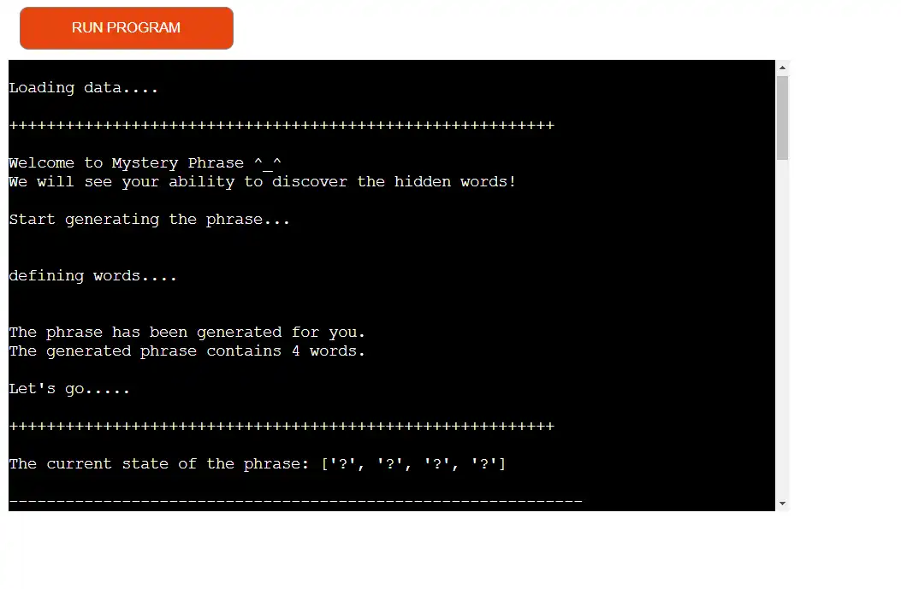
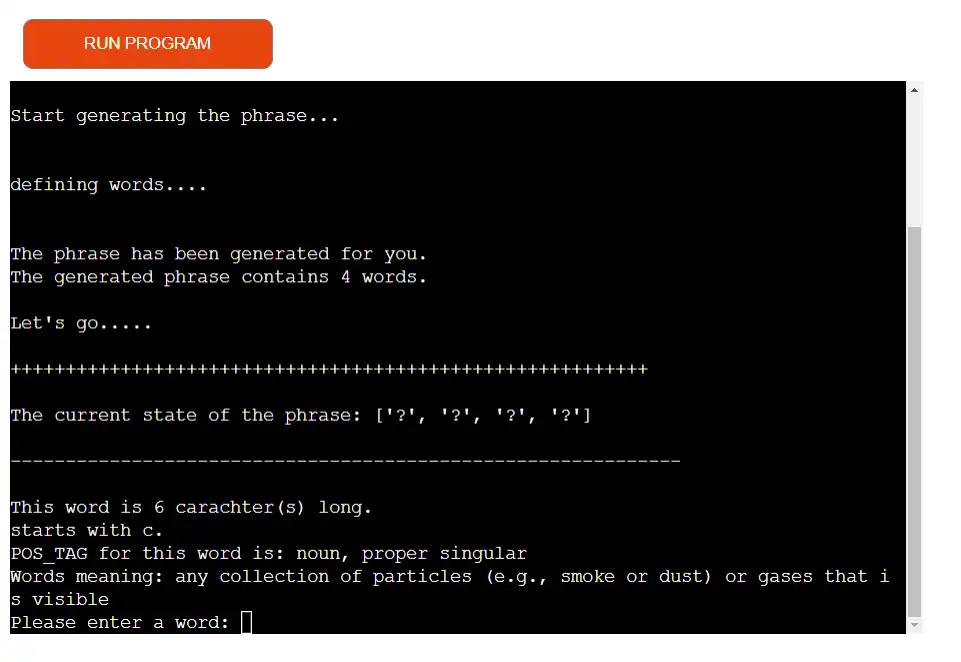
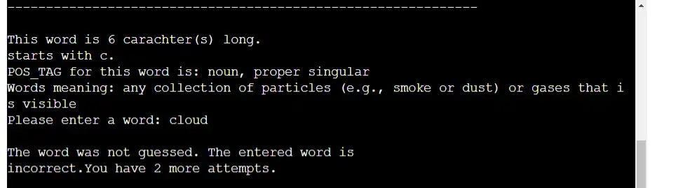
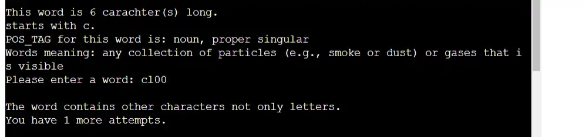
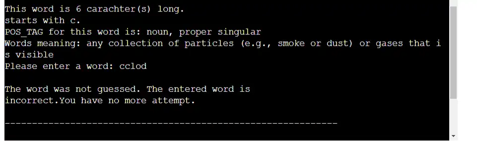
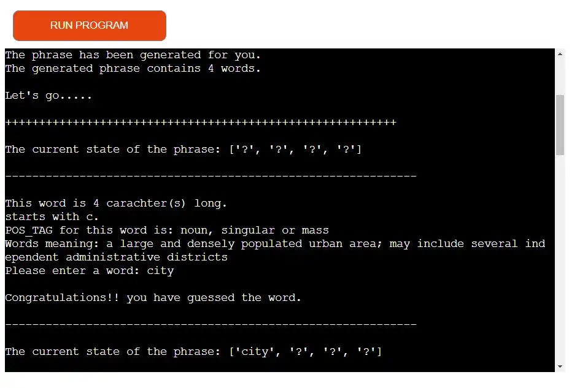
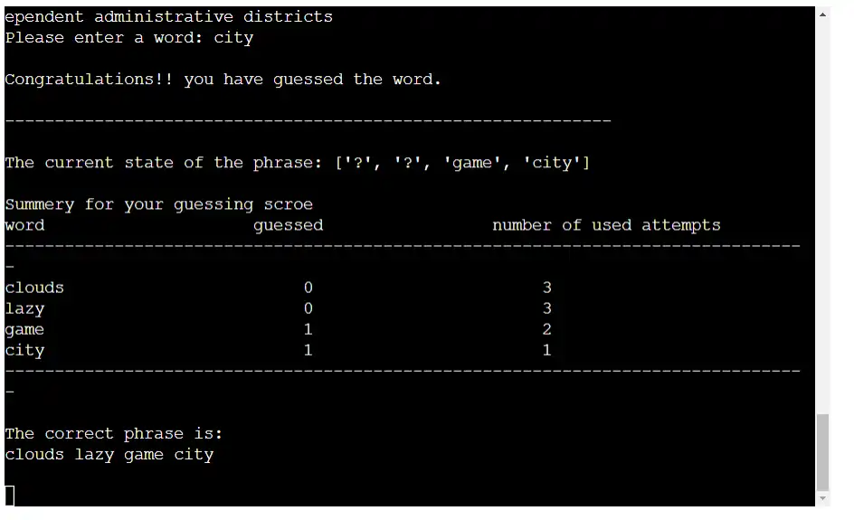
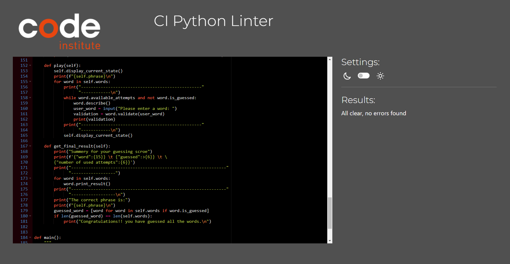

# Mystery Phrase

Welcome to Mystery Phrase – Guessing game.

Visit the deployed project: [Mystery Phrase](https://mystery-phrase-8fa31f8979aa.herokuapp.com/)

## Project Description
The "Mystery Phrase Game" is a game developed using Python in the terminal. The goal of the game is for players to guess a phrase that is randomly generated by the program. The program will create a random phrase, and players must attempt to figure out what the phrase is by guessing various words. The game provides an interactive and engaging experience where players can test their ability to deduce the hidden phrase.

- - -

## CONTENTS

* [How To Play](#how-to-play)
* [Features](#features)
* [Data Model](#data-model)
* [Testing](#testing)
* [Deployment](#deployment)
* [Credits](#credits)

- - -

## How To Play

The program generates a random sentence.For each word in the sentence, a description or clue is shown to the player.The player can attempt to guess the word multiple times. If the player exceeds the allowed number of guesses for a word, the game moves on to the next word.After the player has gone through all the words in the sentence, a summary of the results is displayed, showing how many correct guesses were made and how many attempts were used.

- - - 

## Features

- Random Phrase Generation
  - The program generates a random phrase consisting of four words.
  - For each word in the sentence, the following distinctive characteristics are provided: Word Length, First Letter, Word POS Tag: The grammatical category of the word (e.g., noun, verb, adjective, etc.) and Word Meaning.

- present the description of each word one by one. 
- user is given the opportunity to input their guess for the word.

- The player can continue guessing until they reach the maximum number of attempts allowed for that word.
- If the player enters an incorrect word or a word that contains non-alphabetic characters, the user will be notified with an error message.

- If the user guessed the word the it will displayed in the current starte list.

- After all words in the sentence have been guessed or attempted, a summary of the game results will be displayed, showing the guesses and the number of attempts used.

- Future Features 
  - The length of the sentence will be variable
  - The sentence will be generated in a grammatically correct and syntactically valid manner, based on a large word net.

- - -

## Data Model

The program is modeled using four types of classes:

- **TextProcessor Class:**
This class contains the main methods responsible for processing texts and words, such as generating a random sentence, extracting words from the sentence, determining the POS tag of each word, and providing its meaning.

- **MysteryWord Class:**
The MysteryWord class uses the TextProcessor class as a mixin. It includes properties for each word, such as:
  - word
  - Length
  - First letter
  - Meaning
  - POS tag
  - Number of available attempts
  - Whether the word has been guessed or not.

  It also contains methods for:
   - Describing the word
   - Comparing the user's input with the word
   - Printing the final result for that word

- **MysteryPhrase Class:**
The MysteryPhrase class uses the TextProcessor class as a mixin and contains the following properties:
    - phrase: The randomly generated sentence.
    - Words POS Tag: The types (e.g., noun, verb, etc.) of each word in the phrase.
    - Word list: A collection of the individual words in the phrase as word object of MysteryWord class.

  The class also includes the following methods:
    - Identify Words and Their POS tag: This method determines the POS Tag of each word in the phrase.
    - Describe Sentence
    - Print Current Status: This method displays the current status of the phrase, showing the words that have been guessed correctly so far.

- **Game Class:**
The Game class does not contain any attributes, but it has a relationship with the MysteryPhrase class, as it hase a phrase object.

  The class includes the following methods:
    - Start Game: This method prints the starting messages on the screen to initiate the game.
    - Play Game: This method iterates through the words of the sentence, displays their descriptions, reads user input, and compares the input with the actual word.
    - Final Result: This method prints the final result on the screen after the game ends.

- **main function**
The main function create an object of Game class and excute the start, play an final result functions.

- - -

## Testing 
I have manually tested the project by doing the following: 
  - Passed the code through a PEP8 linter and confirmed there are no problems.
  - Given invalid inputs: words with non-alpha characters or incorrect words, and the code responds correctly.
  - Tested in my local terminal and the Code Institute Heroku terminal.

### Bugs

**Solved Bugs**

There were some errors during the deployment on Heroku.
- rename **runtime.txt** with **.python-version** and remove python- prefix from file content.
- **'nltk.txt' not found, not downloading any corpora**
    
    This issue occurred because I am using NLTK to get the meaning of the word, and therefore, I needed to download WordNet. However, during deployment on Heroku, it is not possible to do this manually. To resolve this, I created a file and named it nltk.txt contains the corpora that being used, so it can be downloaded during the build process on the server.
    Reference to this solution: 
    [nltk.txt](https://medium.com/analytics-vidhya/deploying-nlp-model-on-heroku-using-flask-nltk-and-git-lfs-eed7d1b22b11)

- **Compiled slug size: 570.1M is too large (max is 500M).**

  This issue occurred because I am using spaCy to get the POS tag of the word, and therefore, I needed to load en_core_web_lg. And since its size was very large, I replaced it with en_core_web_sm

**Remaining Bugs:**
- No remaining Bugs

**Validator Testing:**
- PEP8:
   No errors were returned from PEP8online.com

- - - 

## Deployment
This project was deployed using Code Institute's mock terminal for Heroku.

- Steps for deployment:
  - Fork or clone this repository
  - Create a new Heroku app
  - Set the buildpacks to **Python** and **NodeJS** in that order
  - Link the Heroku app to the repository
  - Click on Deploy

- - -

## Credits

### Code Used

* I used [this documentation](https://www.geeksforgeeks.org/python-pos-tagging-and-lemmatization-using-spacy/)  to get word POS tag using **spaCy**.

* I used [this documentation](https://pythonprogramming.net/wordnet-nltk-tutorial/) to get word meaning using **nltk**.

### Acknowledgments

I would like to acknowledge the following people:

* Jubril Akolade - My Code Institute Mentor.

* The Code Institute Course that prepared me to complete this project in the best possible way.

